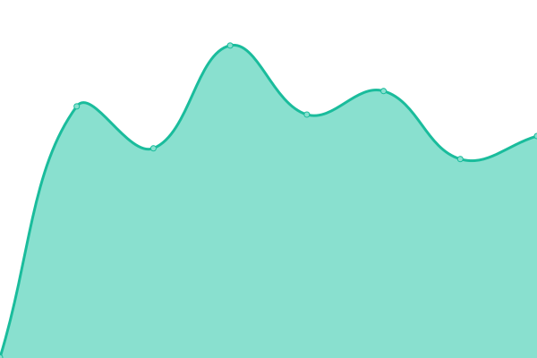
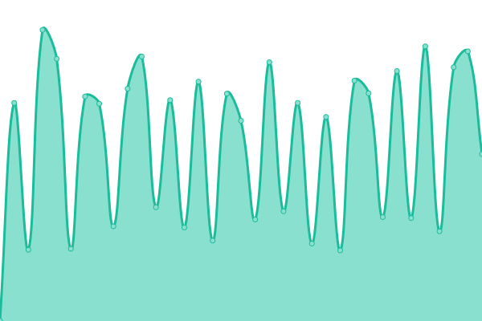
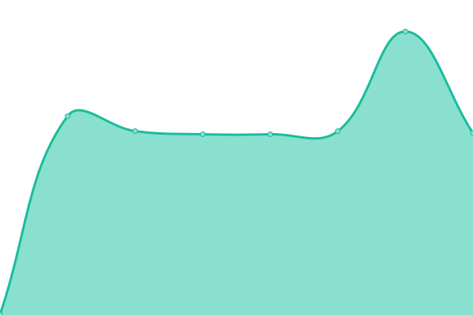
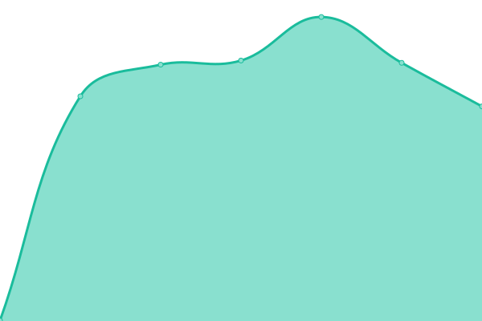
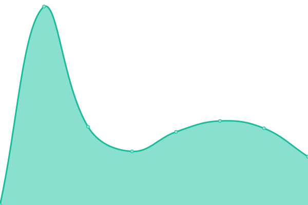
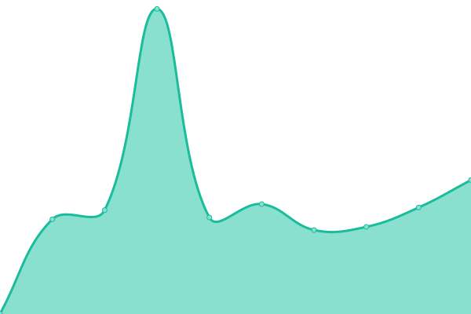
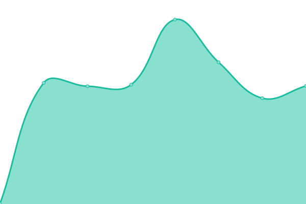

# [📈 Live Status](https://tousleshoraires.github.io/uptime-rr): <!--live status--> **🟧 Partial outage**

This repository contains the open-source uptime monitor and status page for [tousleshoraires](https://tousleshoraires.com), powered by [Upptime](https://github.com/upptime/upptime).

With [Upptime](https://upptime.js.org), you can get your own unlimited and free uptime monitor and status page, powered entirely by a GitHub repository. We use [Issues](https://github.com/tousleshoraires/uptime-rr/issues) as incident reports, [Actions](https://github.com/tousleshoraires/uptime-rr/actions) as uptime monitors, and [Pages](https://tousleshoraires.github.io/uptime-rr) for the status page.

<!--start: status pages-->
<!-- This summary is generated by Upptime (https://github.com/upptime/upptime) -->
<!-- Do not edit this manually, your changes will be overwritten -->
<!-- prettier-ignore -->
| URL | Status | History | Response Time | Uptime |
| --- | ------ | ------- | ------------- | ------ |
|  [ReineRouge.fr](https://reinerouge.fr) | 🟩 Up | [reine-rouge-fr.yml](https://github.com/tousleshoraires/uptime-rr/commits/HEAD/history/reine-rouge-fr.yml) | 

 1046ms
     
 | 

<a href="https://status.reinerouge.fr/history/reine-rouge-fr">100.00%</a>
    

|  [Documentation](https://support.reinerouge.fr) | 🟩 Up | [documentation.yml](https://github.com/tousleshoraires/uptime-rr/commits/HEAD/history/documentation.yml) | 

 1234ms
     
 | 

<a href="https://status.reinerouge.fr/history/documentation">100.00%</a>
    

|  [Compte Démo](https://demo.reinerouge.fr) | 🟩 Up | [compte-demo.yml](https://github.com/tousleshoraires/uptime-rr/commits/HEAD/history/compte-demo.yml) | 

 1212ms
     
 | 

<a href="https://status.reinerouge.fr/history/compte-demo">100.00%</a>
    

|  [Compte TLH](https://tlh.reinerouge.fr) | 🟩 Up | [compte-tlh.yml](https://github.com/tousleshoraires/uptime-rr/commits/HEAD/history/compte-tlh.yml) | 

 1098ms
     
 | 

<a href="https://status.reinerouge.fr/history/compte-tlh">100.00%</a>
    

|  [Tracking - Europe 1](https://tkg1.reinerouge.fr) | 🟥 Down | [tracking-europe-1.yml](https://github.com/tousleshoraires/uptime-rr/commits/HEAD/history/tracking-europe-1.yml) | 

 0ms
     
 | 

<a href="https://status.reinerouge.fr/history/tracking-europe-1">0.00%</a>
    

|  [Tracking - Europe 2](https://tkg2.reinerouge.fr) | 🟥 Down | [tracking-europe-2.yml](https://github.com/tousleshoraires/uptime-rr/commits/HEAD/history/tracking-europe-2.yml) | 

 0ms
     
 | 

<a href="https://status.reinerouge.fr/history/tracking-europe-2">0.00%</a>
    

|  [Tracking - Europe 3](https://tkg3.reinerouge.fr) | 🟩 Up | [tracking-europe-3.yml](https://github.com/tousleshoraires/uptime-rr/commits/HEAD/history/tracking-europe-3.yml) | 

 629ms
     
 | 

<a href="https://status.reinerouge.fr/history/tracking-europe-3">100.00%</a>
    

|  [Tracking - Europe 4](https://tkg4.reinerouge.fr) | 🟩 Up | [tracking-europe-4.yml](https://github.com/tousleshoraires/uptime-rr/commits/HEAD/history/tracking-europe-4.yml) | 

 650ms
     
 | 

<a href="https://status.reinerouge.fr/history/tracking-europe-4">100.00%</a>
    

|  [Tracking - Europe 6](https://tkg6.reinerouge.fr) | 🟩 Up | [tracking-europe-6.yml](https://github.com/tousleshoraires/uptime-rr/commits/HEAD/history/tracking-europe-6.yml) | 

 648ms
     
 | 

<a href="https://status.reinerouge.fr/history/tracking-europe-6">100.00%</a>
    

|  [Tracking - Europe 8](https://tkg8.reinerouge.fr) | 🟥 Down | [tracking-europe-8.yml](https://github.com/tousleshoraires/uptime-rr/commits/HEAD/history/tracking-europe-8.yml) | 

 0ms
     
 | 

<a href="https://status.reinerouge.fr/history/tracking-europe-8">0.00%</a>
    

<!--end: status pages-->

[**Visit our status website →**](https://tousleshoraires.github.io/uptime-rr)

## 📄 License

- Powered by: [Upptime](https://github.com/upptime/upptime)
- Code: [MIT](./LICENSE) © [tousleshoraires](https://tousleshoraires.com)
- Data in the `./history` directory: [Open Database License](https://opendatacommons.org/licenses/odbl/1-0/)
